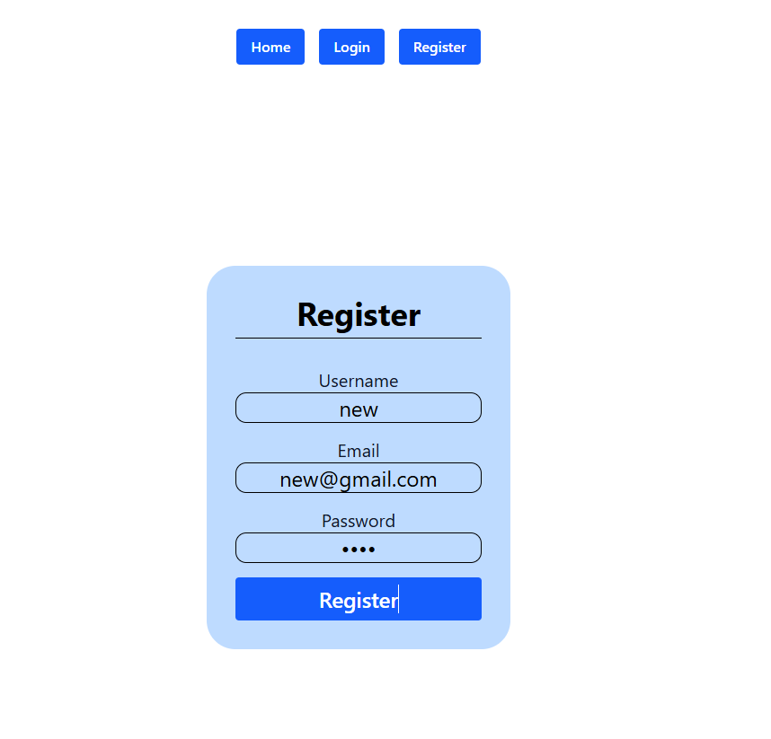
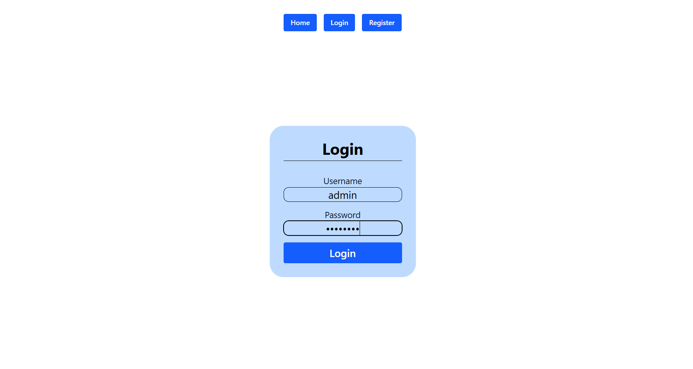
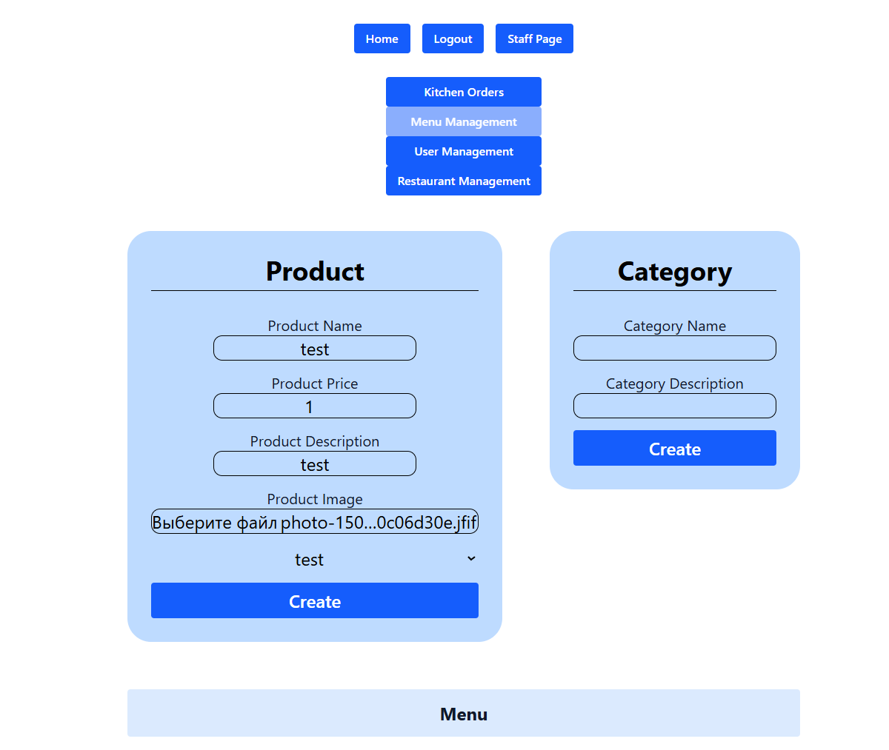
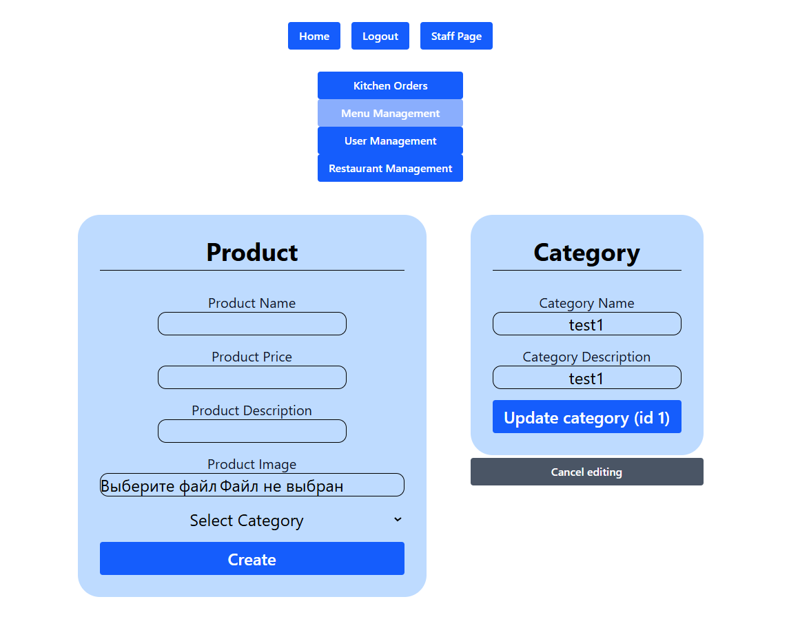
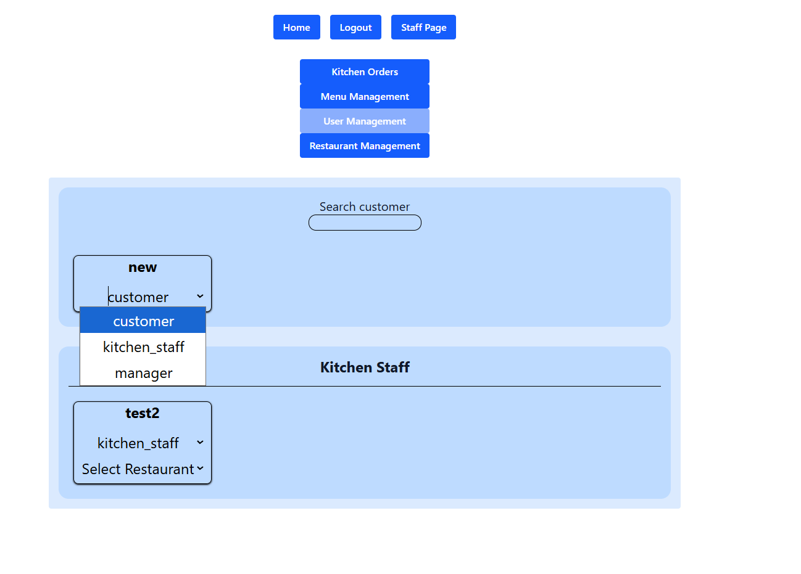
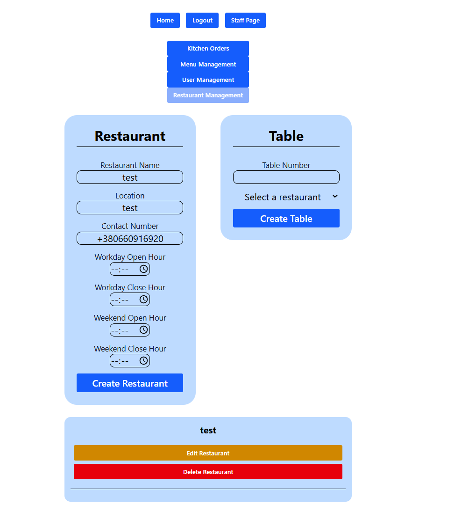
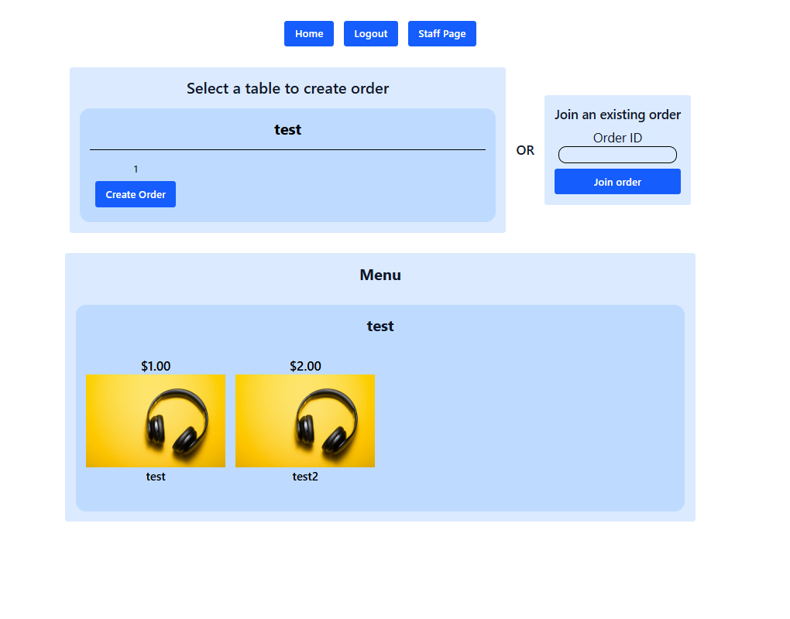
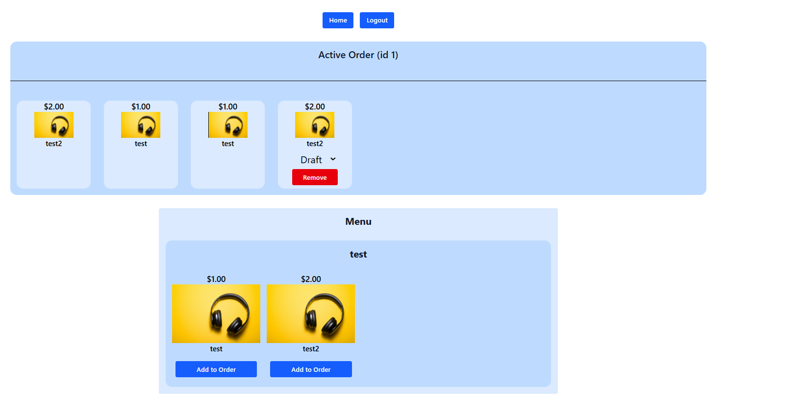
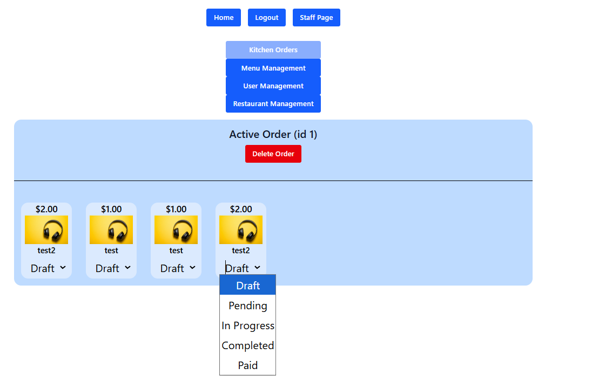
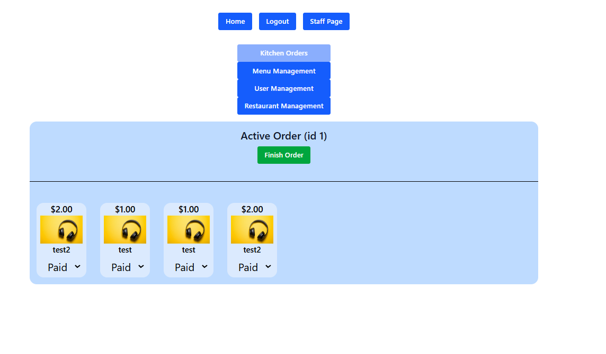

# Restaurant Management App

**Production-ready full-stack application** for restaurant order management, staff roles, menu and restaurant control.

## Tech Stack

**Backend:** Django REST Framework

**Frontend:** React, Redux Toolkit, Tailwind

**Deployment:** Docker Compose, Nginx, SSL

## Features

- User authentication and roles (customer, staff, manager, owner)
- Order creation, participation, and management
- Menu and product management
- Staff and restaurant management
- Real-time status updates for orders and products
- Responsive design for desktop and mobile
- Production deployment with SSL and Docker containerization

## Development Setup

1. Clone repository:

   ```bash
   git clone https://github.com/yourusername/restaurant-app
   cd restaurant-app
   ```

2. Create `.env` file in `/backend` with required secrets:

   ```env
   POSTGRES_PASSWORD=your_postgres_password
   POSTGRES_USER=your_postgres_user
   POSTGRES_DB=your_postgres_db
   DJANGO_SUPERUSER_USERNAME=your_superuser_username
   DJANGO_SUPERUSER_PASSWORD=your_superuser_password
   DJANGO_SUPERUSER_EMAIL=your_superuser_email
   ```

3. Start development environment:

   ```bash
   docker-compose -f docker-compose.dev.yml up --build
   ```

4. Access application:
   - Frontend: http://localhost:5173
   - Backend: http://localhost:8000

## Production Deployment

1. Set up `.env` with extra secrets:

   ```env
   DOMAIN=yourdomain.com
   SECRET_KEY=your_secret_key
   ```

2. Deploy:

   ```bash
   docker-compose -f docker-compose.prod.yml up --build
   ```

3. Access application:
   - Frontend: https://yourdomain.com
   - Backend: https://yourdomain.com/backend

## Screenshots

### Login & Registration

| Register Page                              | Login Page                           |
| ------------------------------------------ | ------------------------------------ |
|  |  |

### Product Management

| Product Creation                               | Product Editing                           |
| ---------------------------------------------- | ----------------------------------------- |
|  |  |

### User Management



### Restaurant Management



### Main Page



### Order Management


### Order Participation



### Kitchen Management

| Kitchen Orders                          | Auto Button Update (finish)                          |
| --------------------------------------- | ---------------------------------------------------- |
|  |  |
